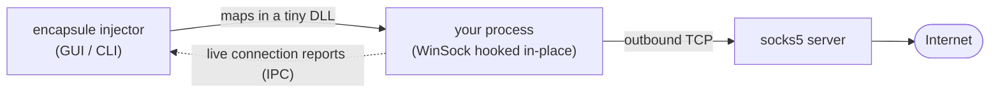

<div align="center">
  

# encapsule

**Wrap any Windows process in a socks5 capsule — no settings, no restarts, no trace.**

[](https://github.com/kardelitaitu/encapsule/actions/workflows/build.yml)
[](https://github.com/kardelitaitu/encapsule/releases)
[](./LICENSE)
[](#)

</div>

---

## Why *encapsule*?

> **en·cap·sule** — to enclose in a capsule.

That's the whole idea. Pick a running process, and encapsule wraps itself around it: every
outbound connection the process makes is sealed inside a socks5 capsule and rerouted through
your proxy. The process keeps running like nothing happened — same window, same workflow —
but its network life now lives inside the capsule, and you can watch every move it makes.

## How it works



1. The **injector** (GUI or CLI) maps a small DLL into the process you picked — it's already
   running, so nothing needs to restart.
2. The **injectee** hooks WinSock in-place, transparently intercepting every outbound TCP
   connection that process attempts.
3. Connections are tunneled through your **socks5 server**, and each one is reported back
   over IPC so the GUI/CLI can show it to you live.

## Features

- 🎯 **Attach to running processes** — target a process by PID, or pick one from the live
  process list in the GUI
- 🔍 **Flexible matching** — short names with wildcards (`py*`, `py??on`), full paths with
  wildcards, or regular expressions for both
- 🚀 **Launch & inject** — start a brand-new process that is encapsulated from the first
  connection after its proxy config lands (`-e`)
- 👶 **Subprocess inheritance** — children spawned by injected processes get encapsulated
  too (`-s`)
- 🧾 **Live connection log** — watch every connection an injected process makes, in real
  time (`-l`)
- 🖥️ **GUI & CLI** — point-and-click with a native GUI, or script it with the CLI
- 🧩 **x64 & x86** — a single x64 build injects both 64-bit and 32-bit (WoW64) targets
- 🕳️ **Any socks5 endpoint** — point the capsule at the proxy of your choice (`-p`)
- 🔐 **Proxy login** — authenticate to that proxy with RFC 1929 username/password, spelled inline
  in the address (`-p user:pass@127.0.0.1:1080`) or typed into the GUI; a refused login fails the
  connection instead of leaking it direct, and encapsule itself never logs or reports the password —
  but on the CLI the login is part of the **command line**, which same-user processes (and Sysmon
  EID 1) can read, so prefer the GUI's credential boxes when that matters

## Preview

### encapsule GUI


### encapsule CLI

```
$ ./encapsule-cli -h
Usage: encapsule-cli [options]

A socks5 proxy injection tool for Windows: just select some processes and make them proxy-able!
Please visit https://github.com/kardelitaitu/encapsule for more information.

Optional arguments:
-h --help                       shows help message and exits [default: false]
-v --version                    prints version information and exits [default: false]
-i --pid                        pid of a process to inject proxy (integer) [default: {}]
-n --name                       short filename of a process with wildcard matching to inject proxy (string, without directory and file extension, e.g. `python`, `py*`, `py??on`) [default: {}]
-P --path                       full filename of a process with wildcard matching to inject proxy (string, with directory and file extension, e.g. `C:/programs/python.exe`, `C:/programs/*.exe`) [default: {}]
-r --name-regexp                regular expression for short filename of a process to inject proxy (string, without directory and file extension, e.g. `python`, `py.*|exp.*`) [default: {}]
-R --path-regexp                regular expression for full filename of a process to inject proxy (string, with directory and file extension, e.g. `C:/programs/python.exe`, `C:/programs/(a|b).*\.exe`) [default: {}]
-e --exec                       command line started with an executable to create a new process and inject proxy (string, e.g. `python` or `C:\Program Files\a.exe --some-option`) [default: {}]
-l --enable-log                 enable logging for network connections [default: false]
-p --set-proxy                  set a proxy address for network connections (string, `[user[:pass]@]host:port`, e.g. `127.0.0.1:1080`, `[2001:db8::1]:1080` or `user:pass@127.0.0.1:1080`) [default: ""]
-w --new-console-window         create a new console window while a new console process is executed in `-e` [default: false]
-s --subprocess                 inject subprocesses created by these already injected processes [default: false]
```

## How to Install

Choose whichever method you like:

- Download the latest portable archive (`.zip`) or installer (`.exe`) from the [Releases Page](https://github.com/kardelitaitu/encapsule/releases), OR
- Type `winget install PragmaTwice.encapsule` in the terminal ([winget](https://github.com/microsoft/winget-cli) is required)

Or build from source (not recommended for non-professionals):

```sh
# make sure your develop environment is well configured in powershell
git clone https://github.com/kardelitaitu/encapsule.git
cd encapsule
./build.ps1 -mode Release -arch x64 # build the project via CMake and msbuild
# your built binaries are now in the `./release` directory, enjoy it now!
makensis /DVERSION=$(git describe --tags) setup.nsi # (optional) genrate an installer via NSIS
```

## Development Dependencies

### environments:

- C++ compiler (with C++20 support, currently MSVC)
- Windows SDK (with winsock2 support)
- CMake >= 3.20 (`cmake_minimum_required`, CMakeLists.txt:16)

### libraries: 
(you do not need to download/install them manually)

#### injectee (`src/injectee`)
- minhook
- asio (standalone)
- PragmaTwice/protopuf

#### injector GUI (`src/injector`)
- asio (standalone)
- PragmaTwice/protopuf
- cycfi/elements

#### injector CLI (`src/injector`)
- asio (standalone)
- PragmaTwice/protopuf
- p-ranav/argparse
- gabime/spdlog

## License

[Apache-2.0](./LICENSE)
